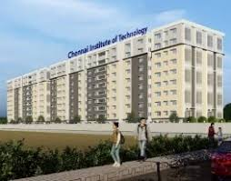

# Ex04 Places Around Me
## Date: 08.10.2025
## Name: LINGESH D
## AIM
To develop a website to display details about the places around my house.

## DESIGN STEPS

### STEP 1
Create a Django admin interface.

### STEP 2
Download your city map from Google.

### STEP 3
Using ```<map>``` tag name the map.

### STEP 4
Create clickable regions in the image using ```<area>``` tag.

### STEP 5
Write HTML programs for all the regions identified.

### STEP 6
Execute the programs and publish them.

## CODE
```
<!-- Image Map Generated by http://www.image-map.net/ -->


<map name="image-map">
    <area target="_blank" alt="SEC" title="SEC" href="SEC.html" src="SEC.jpg" coords="915,443,1031,512" shape="rect">
    <area target="_blank" alt="REC" title="REC" href="REC.html" src="rec.jpg" coords="760,546,862,615" shape="rect">
    <area target="_blank" alt="SVCE" title="SVCE" href="SVCE.html" src="SVCE.webp" coords="618,663,713,724" shape="rect">
    <area target="_blank" alt="CIT" title="CIT" href="CIT.html" src="cit.jpg" coords="1089,812,967,740" shape="rect">
    <area target="_blank" alt="PEC" title="PEC" href="PEC.html"  src="pec.jpg"  coords="601,109,710,187" shape="rect">
</map>

CIT
<!DOCTYPE html>
<html lang="en">
<head>
    <meta charset="UTF-8">
    <meta name="viewport" content="width=device-width, initial-scale=1.0">
    <title>Document</title>
</head>
<body  bgcolor="yellow">
     <h1 align="center" >Saveetha Engineering College</h1>   
    <p>Chennai Institute of Technology (CIT) is a private engineering college located in Kundrathur, Chennai, Tamil Nadu, India. Established in 2010, the institution is affiliated with Anna University and approved by the All India Council for Technical Education (AICTE).The college operates under the Parthasarathy Seeniammal Educational Trust and offers undergraduate, postgraduate, and doctoral programs in engineering and technology disciplines.</p>

</body>
</html>

PEC
<!DOCTYPE html>
<html lang="en">
<head>
    <meta charset="UTF-8">
    <meta name="viewport" content="width=device-width, initial-scale=1.0">
    <title>Document</title>
</head>
<body bgcolor="green">
    <h1 align="center" >Prathyusha Engineering College</h1>
   <p> Prathyusha Engineering College (PEC) is an autonomous, self-financed Telugu minority institution established in 2001 in Chennai, affiliated with Anna University. Located in a serene environment near Chennai, the college offers various undergraduate and postgraduate engineering programs, including B.Tech and Ph.D. degrees. PEC is approved by AICTE, accredited by NBA and NAAC, and holds ISO certification, indicating a focus on quality technical education and facilities, including modern labs and a green campus.</p> 

</body>
</html>

SEC
<!DOCTYPE html>
<html lang="en">
<head>
    <meta charset="UTF-8">
    <meta name="viewport" content="width=device-width, initial-scale=1.0">
    <title>Document</title>
</head>
<body bgcolor="aqua">
    <h1 align="center" >Saveetha Engineering College</h1>
    <p align="center">Saveetha Engineering College (SEC) is a private institution in Chennai, established in 2001, offering undergraduate, postgraduate, and doctoral programs in engineering, management, and technology. Affiliated with Anna University, SEC holds an 'A' Grade accreditation from NAAC, is approved by the UGC, and is recognized as a Scientific and Industrial Research Organization (SIRO) by the DSIR. The college emphasizes a holistic approach to education, featuring numerous centers of excellence in areas like AI, robotics, and cybersecurity, and a strong focus on industry-aligned project work.</p> 

</body>
</html>

SVEC
<!DOCTYPE html>
<html lang="en">
<head>
    <meta charset="UTF-8">
    <meta name="viewport" content="width=device-width, initial-scale=1.0">
    <title>Document</title>
</head>
<body bgcolor="orange">
    <h1 align="center">Sri Venkateswara College of Engineering</h1>
   <p> Sri Venkateswara College of Engineering (SVCE) Tirupati is a private engineering college established in 2007, located on Karakambadi Road in Tirupati, Andhra Pradesh. The college offers various undergraduate and postgraduate engineering programs and is affiliated with Jawaharlal Nehru Technological University, Anantapur (JNTUA). SVCE is recognized by the AICTE and aims to provide technical education, research, and services, with specialties in Computer Science, Mechanical Engineering, and other fields.</p> 

</body>
</html>

REC
<!DOCTYPE html>
<html lang="en">
<head>
    <meta charset="UTF-8">
    <meta name="viewport" content="width=device-width, initial-scale=1.0">
    <title>Document</title>
</head>
<body bgcolor="red">
       <h1 align="center" >rajalakshmi Engineering College</h1>
   <p align="center"> Rajalakshmi Engineering College (REC), located near Chennai, is an autonomous, AICTE-approved private institution established in 1997 by the Rajalakshmi Educational Trust, offering various undergraduate and postgraduate engineering, technology, and management programs. Affiliated with Anna University, REC holds prestigious accreditations, including NAAC A++, and has received recognition from the UGC and DSIR/SIRO. The college is recognized for its strong infrastructure, faculty, research centers, and various student amenities.</p>

</body>
</html>
```

## OUTPUT




## RESULT
The program for implementing image maps using HTML is executed successfully.
